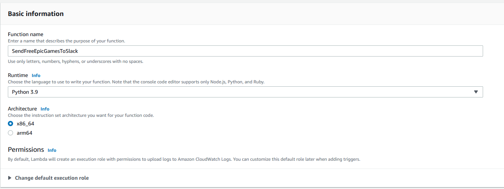
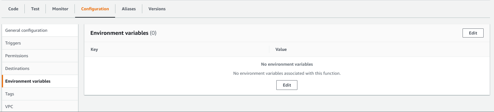

# Description
This is a simple project that runs a script to check the Epic game store for this week's new free game(s) and the posts the game(s) to a Slack channel. I'm using AWS Lambda to run the code and AWS Cloudwatch Events to trigger the Lambda at a specific day and time.

---

# Setup
### 1) Create an app in Slack (https://api.slack.com/apps)
1. Click the **Create New App** button
2. **Choose how you'd like to configure you app's scopes and settings**: From scratch
3. **App Name**: Whatever you want (This will be what shows up in Slack)
4. **Pick a workspace to develop your app in**: Wherever you want to deploy this (You must have the rights to edit the workspace)

### 2) Configure permissions in slack and add to Workspace
1. Click the **Permissions** button under the **Add features and functionality** section.
2. Scroll down to the **Scopes** section and find the **Bot Token Scopes** option.
3. Click the **Add an OAuth Scope** button
4. Add the **chat:write** permission.
5. Scroll back up and click the **Install to Workspace** button towards the top of the page.
6. You should now see a **Bot User OAuth Token** box under the **OAuth Tokens for Your Workspace** heading. It will start with `xoxb-`. Copy this and save it for later.

### 3) Create an AWS Lambda function. (https://console.aws.amazon.com/lambda)
1. **Function name**: Whatever you want.
2. **Runtime**: Python 3.9 (latest at the time of writing)
3. **Architecture**: x86_64

### 4) Add environment variables to AWS Lambda
#### Slack Token
1. Click on the **Configuration** tab in the middle of the screen, then select **Environment variables** from the menu on the left.
2. Click **Edit**, then click the **Add environment variable** button.
3. **Key**: `SLACK_TOKEN`
4. **Value**: `<your slack token>`
5. Click **Save**

#### Slack Channel ID
You can get your channel ID by opening the Slack desktop client, going to the workspace that you added the app to, right-clicking on the channel name, then selecting **Open channel settings**. At the bottom of the pop-up you should see something that says **Channel ID: XXXXXXXX**, copy that.

1. Click on the **Configuration** tab in the middle of the screen, then select **Environment variables** from the menu on the left.
2. Click **Edit**, then click the **Add environment variable** button.
3. **Key**: `SLACK_CHANNEL_ID`
4. **Value**: `<your slack channel ID>`
5. Click **Save**

#### Setup automatic deployment from Github to AWS Lambda
https://blog.jakoblind.no/aws-lambda-github-actions
